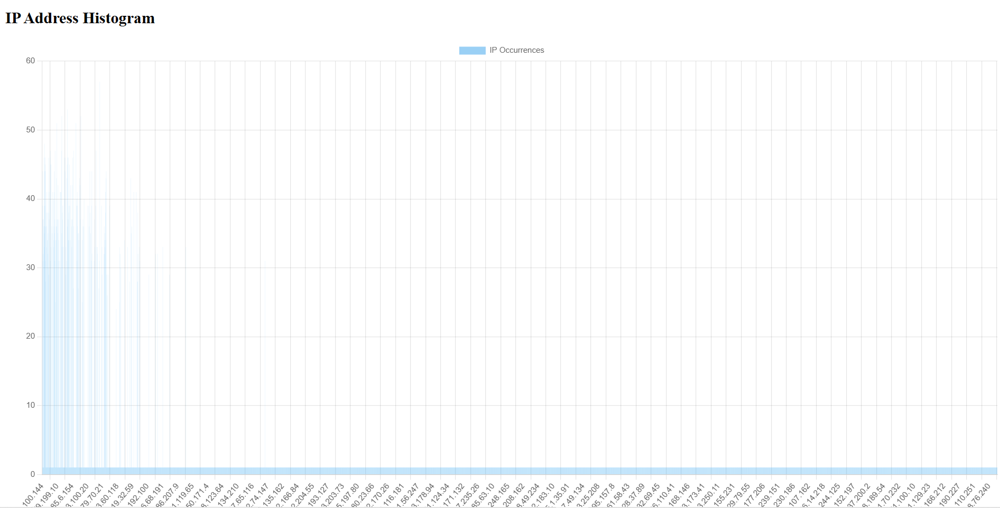
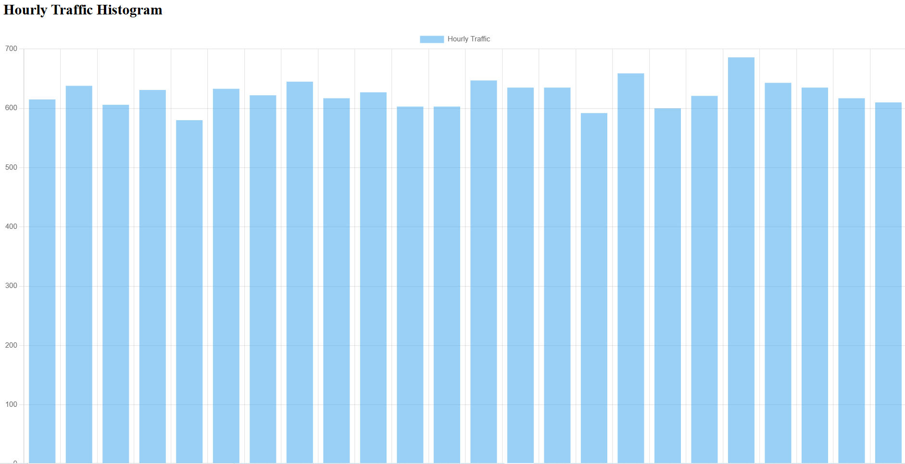

# Log File Analyzer

A Node.js application that analyzes web server log files to provide insights about traffic patterns and top contributors.

## Features

- Parses standard web server log files
- Tracks unique IP addresses and their request counts
- Analyzes hourly traffic distribution
- Identifies top traffic contributors based on configurable percentage thresholds
- Serves results via a web interface

## Installation

1. Clone this repository

```bash
git clone https://github.com/yourusername/log-analyzer.git
cd log-analyzer
```

2. Install dependencies

```bash
npm install
```

3. Create a log file in the project root (if not exists)

```bash
touch access.log
```

4. Start the server

```bash
node server.js
```

5. Open your browser and navigate to `http://localhost:3000` to view the results

## Usage

1. The application will automatically parse the log file and display the results on the web page

2. The web page will display a list of unique IP addresses and their request counts

3. The web page will display a histogram of hourly traffic distribution

4. The web page will display a list of top traffic contributors based on configurable percentage thresholds

## Configuration

The application is configured using the `config.json` file.


## Contributing

1. Fork the repository

2. Create a new branch

3. Make your changes and commit them

4. Push your changes to your fork

5. Create a pull request







